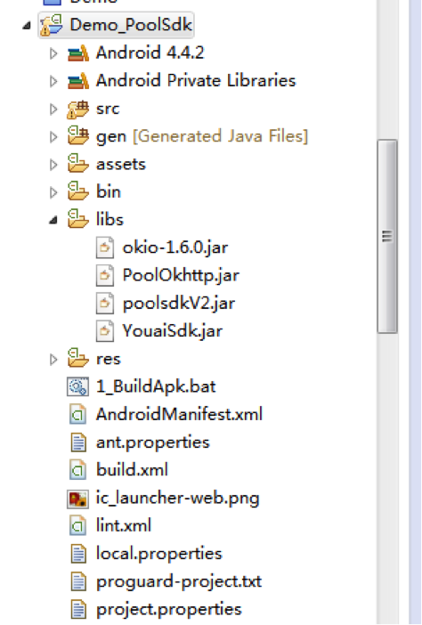
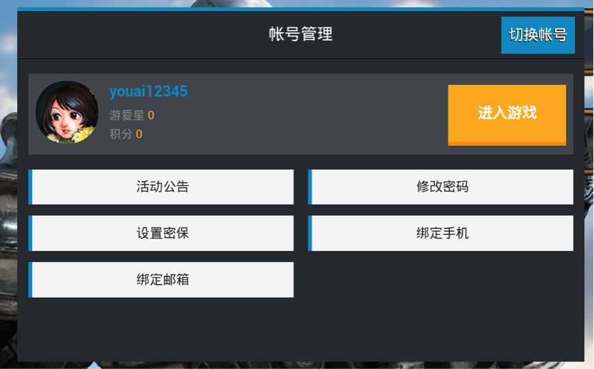
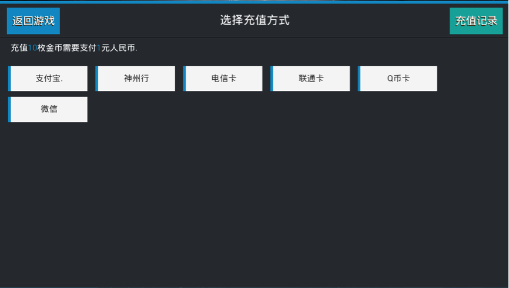
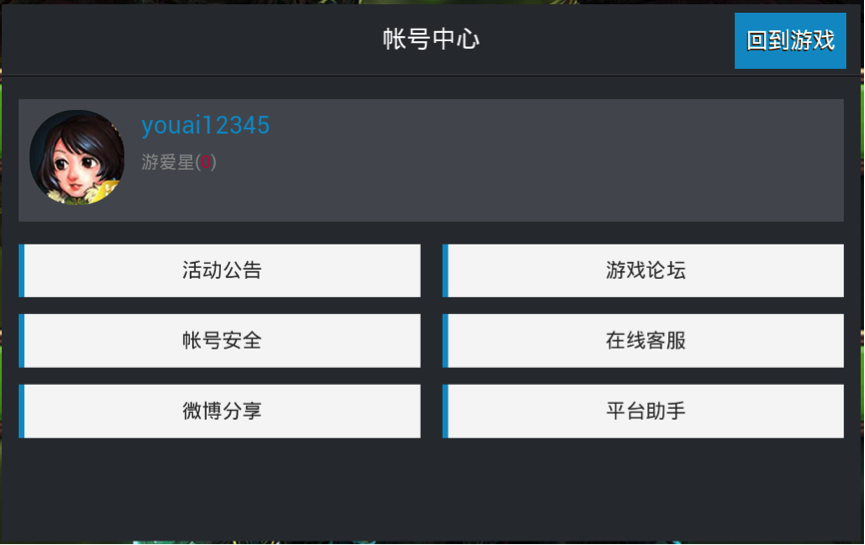

#SDK 接入文档

###1、开发环境搭建
    以下是以 Eclipse 为例,在 Eclipse 环境下开发的 SDK 配置
    1.1、将 SDK 压缩包中 Jar 目录下的所有 jar 包复制到游戏工程的libs 目录下

    
    1.2、将1.1中复制的jar包引用到游戏工程
    1.3、复制SDK压缩包中assets目录下的所有内容到游戏工程的assets目录，将游戏中的闪屏图片放
    到assets中poolsdk_splash目录下，将assets中的poolsdk.xml中的payCallbackUrl参数配置为游
    戏测试的充值回调地址（注：此回调地址为测试使用，正式环境以SDK后台配置的地址为准）
    1.4、修改游戏工程的AndroidManifest.xml（可以参照复制Demo中	AndroidManifest.xml文件）
        ①．添加声明权限：
        <uses-permission android:name="android.permission.INTERNET" />
        <uses-permission android:name="android.permission.WRITE_EXTERNAL_STORAGE" />
        <uses-permission android:name="android.permission.MOUNT_UNMOUNT_FILESYSTEMS" />
 	    <uses-permission android:name="android.permission.RECEIVE_BOOT_COMPLETED" />
        <uses-permission android:name="android.permission.INTERNET" />
        <uses-permission android:name="android.permission.ACCESS_NETWORK_STATE" />
        <uses-permission android:name="android.permission.READ_PHONE_STATE" />
        <uses-permission android:name="android.permission.WRITE_EXTERNAL_STORAGE" />
        <uses-permission android:name="android.permission.ACCESS_WIFI_STATE" />
        <uses-permission android:name="android.permission.SYSTEM_ALERT_WINDOW" />
        <uses-permission android:name="android.permission.READ_LOGS" />
        <uses-permission android:name="android.permission.GET_TASKS" />
        
        ②．添加对应的Activity，service，receiver等：
        <!-- start YouaiSDK -->
        <receiver
            android:name="com.gzyouai.fengniao.sdk.framework.AppInstallReceiver"
            android:label="@string/app_name" >
            <intent-filter>
                <action android:name="android.intent.action.PACKAGE_ADDED" />
                <action android:name="android.intent.action.PACKAGE_REPLACED" />
                <action android:name="android.intent.action.PACKAGE_REMOVED" />
                <data android:scheme="package" />
            </intent-filter>
        </receiver>
        <!-- start i9133 -->
        <activity
            android:name=".wxapi.WXPayEntryActivity"
            android:exported="true"
            android:launchMode="singleTop" />
        <activity
            android:name="com.youai.sdk.YouaiSDK"
            android:label="youai_sdk"
            android:theme="@android:style/Theme.Dialog" >
        </activity>
        <service
            android:name="com.youai.sdk.YouaiService"
            android:enabled="true" >
            <intent-filter>
                <action android:name="com.youai.sdk.YouaiService" />
            </intent-filter>
        </service>
        <service
            android:name="com.youai.sdk.FloatViewService"
            android:enabled="true"
            android:exported="true" >
            <intent-filter>
                <action android:name="com.youai.sdk.FloatViewService" />
            </intent-filter>
        </service>
        <receiver android:name="com.youai.sdk.Receiver" >
            <intent-filter>
                <action android:name="android.intent.action.BOOT_COMPLETED" >
                </action>
                <category android:name="android.intent.category.LAUNCHER" />
            </intent-filter>
        </receiver>
        <activity
            android:name="com.alipay.sdk.app.H5PayActivity"
            android:configChanges="orientation|keyboardHidden|navigation"
            android:exported="false"
            android:screenOrientation="behind" >
        </activity>
        <activity
            android:name="com.alipay.sdk.auth.AuthActivity"
            android:configChanges="orientation|keyboardHidden|navigation"
            android:exported="false"
            android:screenOrientation="behind" >
        </activity>
        <!-- end i9133 -->
        
###2、功能接口
    (注意:以下所有接口都必须在 SDK 初始化完成之后才能调用)
    2.1、继承 PoolSDKApplication(必接)
        说明: 
        游戏工程如果没有Application,请在 AndroidManifest.xml 中添加SDK的Application,如下所示:
        <application  android:name="com.gzyouai.publicsdk.application.PoolSDKApplication">
        游戏工程如果有 Application,请继承 SDK 中 PoolSDKApplication:
        public class XXXXApplication extends PoolSDKApplication { 
            @Override
            public void onCreate() {
                // TODO Auto-generated method stub
                super.onCreate();
            } 
        }
    2.2、初始化接口(必接)
        接口说明:
        首先在程序开始的地方调用 SDK 的初始化 init 方法,并设 置 Activity 对像和初始化完成回调
        监听(在初始化失败情况下不 再调用其它 SDK 接口方法)
        注意:要确保在 SDK 初始化成功后才可调用其它接口
        2.2.1、方法定义
            public static void init(final Activity activity,final PoolSDKCallBackListener callBackListener) 
        2.2.2、参数说明
参数 |说明
------------ 		| ------------- 
activity 			| Activity 对应  
callBackListener 	| 初始化完成回调通知,需实现 poolSdkCallBack 方法        	

        2.2.3、代码示例:
        PoolSdkHelper.init(this, new PoolSDKCallBackListener() {
			@Override
			public void poolSdkCallBack(int code, String msg) {
				// TODO Auto-generated method stub
				switch (code) {
				case PoolSDKCode.POOLSDK_INIT_SUCCESS://初始化成功
					PoolSdkLog.logInfo("游戏中POOLSDK_INIT_SUCCESS");
					login();
					break;
				case PoolSDKCode.POOLSDK_INIT_FAIL:
					break;
				default:
					break;
				}
			}
		});
	
	2.3、登录接口(必接)
	    接口说明:游戏登录时调用
	    2.3.1、方法定义
	    public static void login(final String paramCustom,final PoolLoginListener poolLoginListener)
	    2.3.2、参数说明
参数 |说明
------------ 		| ------------- 
paramCustom 		| 游戏自定义参数,可通过登录成功回调方法onLoginSuccess 中的参数PoolLoginInfo 对象的 getCustom()获取  
poolLoginListener 	| 登录结果回调通知,需实现 onLoginSuccess 方法
	    
	    2.3.3、代码示例
    		PoolSdkHelper.login("登录自定义字段", new PoolLoginListener() {
    			@Override
    			public void onLoginSuccess(PoolLoginInfo poolLoginInfo) {
    				String userType = poolLoginInfo.getUserType();
    				String timestamp = poolLoginInfo.getTimestamp();
    				String serverSign = poolLoginInfo.getServerSign();
    				String openId = poolLoginInfo.getOpenID();
    				//把以上信息发送给游戏服务端做登录校验，需要其他信息请从poolLoginInfo对象中获取
    				System.out.println("登录成功  userType = " + userType
    						+ "; timestamp = " + timestamp + "; serverSign = "
    						+ serverSign + "; openId = " + openId);
    			}
    			@Override
    			public void onLoginFailed(String errorMsg) {
    				System.out.println("登录失败  = " + errorMsg);
    			}
    		});
    		
    2.4、提交角色数据接口(必接)
        接口说明:游戏提交角色数据接口,该接口需要在以下 3 中情况下
        调用:进入游戏主场景、创建角色、角色升级
        2.4.1、方法定义
        public static void submitRoleData(final PoolRoleInfo poolRoleInfo,
			final PoolRoleListener poolRoleListener)
		2.4.2、参数说明
参数 |说明
------------ 		| ------------- 
poolRoleInfo 		| 角色数据实体类
poolRoleListener 	| 角色数据提交结果回调通知,需实现
		
		PoolRoleInfo 实体类字段说明
字段名 				|说明
------------ 		| ------------- 
callType 			| 调用类型Type_EnterGame 登录游戏主 场景;Type_CreatRole 为创建角 色;Type_RoleUpgrade 为角色升级
roleId			 	| 角色 Id
roleName 			| 角色名称
roleLevel 			| 角色等级
roleSex 			| 角色性别(1 男 0 女,如果角 色不分性别请填写 0)
serverId 			| 服务器 id
serverName 			| 服务器名称
custom 				| 创建角色时间(以秒为单位)
		
		2.4.3、代码示例
		/********************************************
		 * 以下所有字段都是必填项
		 */
		PoolRoleInfo poolRoleInfo = new PoolRoleInfo();
		poolRoleInfo.setRoleID("123456");
		poolRoleInfo.setRoleLevel("10");
		poolRoleInfo.setRoleSex("0");
		poolRoleInfo.setRoleName("我是角色名");
		poolRoleInfo.setServerID("1");
		poolRoleInfo.setServerName("我是服务器名");
		poolRoleInfo.setCustom("角色创建时间");
		poolRoleInfo.setCallType(PoolRoleInfo.Type_EnterGame);
		// poolRoleInfo.setCallType(PoolRoleInfo.Type_CreateRole);
		// poolRoleInfo.setCallType(PoolRoleInfo.Type_RoleUpgrade);

		PoolSdkHelper.submitRoleData(poolRoleInfo, new PoolRoleListener() {
			@Override
			public void onRoleDataSuccess(String paramCustom) {
				System.out.println("提交角色数据成功  = " + paramCustom);
			}
		});
		
	2.5、支付接口(必接)
	    2.5.1、方法定义
	        public static void pay(final PoolPayInfo poolPayInfo,final PoolPayListener poolPayListener)
	    2.5.2、参数说明
参数 |说明
------------ 		| ------------- 
poolRoleInfo 		| 角色数据实体类
poolRoleListener 	| 角色数据提交结果回调通知,需实现
		
	   支付信息实体类(PoolPayInfo)字段说明
参数 |说明
------------ 		| ------------- 
amount 		| 金额(单位元,必须大于 0)
productId 	| 商品 ID(如果没有可以传空字符 串)
productName | 商品描述
roleid 		| 角色 id
rolelevel 		| 角色等级
roleName 	| 角色名称
serverId 		| 服务器 id
serverName 	| 服务器名称
exchange 		| 游戏币与人民币(元)的兑换比例
custom 	| 自定义透传参数,通过回调函数原样返回
	   
	   2.5.3、代码示例
	        /********************************************
		    * 以下所有字段都是必填项
		    */
		    // 设置充值金额，单位“元”
		    poolPayInfo.setAmount("1");
		    // 服务器id
		    poolPayInfo.setServerID("8");
    		// 服务器名
    		poolPayInfo.setServerName("我是服务器名");
    		// 角色id
    		poolPayInfo.setRoleID("123456");
    		// 角色名
    		poolPayInfo.setRoleName("我是角色名");
    		// 角色等级
    		poolPayInfo.setRoleLevel("10");
    		// 商品ID
    		poolPayInfo.setProductID("1");
    		// 商品名称
    		poolPayInfo.setProductName("金币");
    		// 商品描述
    		poolPayInfo.setProductDesc("购买金币");
    		// 兑换比例
    		poolPayInfo.setExchange("10");
    		// 自定义参数
    		poolPayInfo.setCustom("我是自定义参数");
    		// TODO Auto-generated method stub
    		PoolSdkHelper.pay(poolPayInfo, new PoolPayListener() {
    			@Override
    			public void onPaySuccess(String paramCustom) {
    				System.out.println("支付成功  = " + paramCustom);
    			}
    			@Override
    			public void onPayFailed(String paramCustom, String errorMsg) {
    				System.out.println("支付失败  = " + paramCustom + "; errorMsg = "
    						+ errorMsg);
    			}
    		});
    		
    2.6、检测 SDK 是否含有用户中心接口(必接)
        说明:如果接口返回为 true,表示需要游戏方在合适的界面中添加一个用户中心的按钮,点击按钮时调用文
        档中 2.7 的用户中心接口;如果返回 false,则不做处理
        2.6.1、方法定义
            public static boolean hasChannelCenter() 
    2.7、用户中心接口(必接)
    	说明:打开渠道用户中心界面
    	2.7.1、方法定义
    	public static void openChannelCenter()
    	2.7.2、代码示例
    	/**
	 * 用户中心
	 * 
	 * 游戏方先调用YASDKHelper.hasChannelCenter()获取是否有用户中心，
	 * 如果有的话，游戏中需要添加按钮，点击按钮调用YASDKHelper.openChannelCenter();
	 * 如果没有，则不需要显示按钮，也不用调用下面的接口
	 */
	private void channelCenter() {
		PoolSdkHelper.openChannelCenter();
	}

    2.8、注销登录监听接口
    	说明:可在游戏启动时设置注销监听事件,渠道注销成功后 SDK 会回调 onLogoutSuccess 方法通知游戏,游戏可在此处理切换账号逻辑
    	2.8.1、方法定义
    	public static void setLogoutCallback(final PoolLogoutListener poolLogoutListener)
    	2.8.2、参数说明
 参数 |说明
------------ 		| ------------- 
poolLogoutListener 		| 账户注销成功回调监听,需实现 onLogoutSuccess 方法
    	
    	2.8.3、代码示例
    	    PoolSdkHelper.setLogoutCallback(new PoolLogoutListener() {
		@Override
		public void onLogoutSuccess() {
		    // TODO: 此处处理SDK登出的逻辑
		    login();
		    PoolSdkLog.logInfo("游戏中logoutSuccess");
		}
	    });	
    2.9、退出游戏接口(必接)
    	说明:在游戏需要退出时调用,调用此接口时需先用 PoolSdkHelper.hasExitDialog() 判断 sdk 是否有退出界
    	面,为 true表示有退出界面需调用 showExitDialog()显示退出界面,为 false 时表示没有退出界面,游戏需自己处
    	理退出逻辑且在确认 游戏退出前调用 PoolSdkHelper.exitGame 通知 SDK 游戏要退出 (具体可参照 Demo 示例)
    	2.9.1、方法定义
    	    public static void showExitDialog(final PoolExitDialogListener exitDialogListener)
    	2.9.2、参数说明
  参数 |说明
------------ 			| ------------- 
exitDialogListener 		| 退出结果回调监听,需实现 onDialogResult 方法

    	
    	2.9.3、代码示例
    	    @Override
	    public boolean dispatchKeyEvent(KeyEvent pKeyEvent) {
		if (pKeyEvent.getKeyCode() == KeyEvent.KEYCODE_BACK
				&& pKeyEvent.getAction() == KeyEvent.ACTION_DOWN) {
			if (PoolSdkHelper.hasExitDialog()) {
				PoolSdkHelper.showExitDialog(new PoolExitDialogListener() {
					@Override
					public void onDialogResult(int code, String msg) {
						// TODO Auto-generated method stub
						switch (code) {
						case PoolSDKCode.EXIT_SUCCESS:// 退出成功游戏处理自己退出逻辑
							finish();
							// System.exit(0);
							break;
						case PoolSDKCode.EXIT_CANCEL:// 取消退出
							break;
						default:
							break;
						}
					}
				});
			} else {
				// TODO: 调用游戏的退出界面
				showGameExitTips();
			}
			return false;
		}
		return super.dispatchKeyEvent(pKeyEvent);
	    }
    2.10、Android 生命周期接口(必接)
    	说明:在游戏 Activity 的 onStart、onPause、onResume、 onStop、onDestroy、onRestart、onNewIntent、 onActivityResult、onConfigurationChanged 中分别调用对应的接口
    	2.10.1、代码示例
    	    @Override
	    public void onStart() {
		super.onStart();
		PoolSdkHelper.onStart();
	    }

	    @Override
	    public void onStop() {
		super.onStop();
		PoolSdkHelper.onStop();
	    }

	    @Override
	    public void onDestroy() {
		super.onDestroy();
		PoolSdkHelper.onDestroy();
	    }

	    @Override
	    public void onResume() {
		super.onResume();
		PoolSdkHelper.onResume();
	    }

	    @Override
	    public void onPause() {
		super.onPause();
		PoolSdkHelper.onPause();
	    }

	    @Override
	    public void onRestart() {
		super.onRestart();
		PoolSdkHelper.onRestart();
	    }

	    @Override
	    public void onNewIntent(Intent intent) {
		super.onNewIntent(intent);
		PoolSdkHelper.onNewIntent(intent);
	    }

	    @Override
	    protected void onActivityResult(int requestCode, int resultCode, Intent data) {
		PoolSdkHelper.onActivityResult(requestCode, resultCode, data);
	    }

	    @Override
	    public void onConfigurationChanged(Configuration newConfig) {
		// TODO Auto-generated method stub
		super.onConfigurationChanged(newConfig);
		PoolSdkHelper.onConfigurationChanged(newConfig);
	    }
    2.11、扩展接口(可选)
    	说明:该接口为扩展的万能接口,留作备用,目前游戏方可以不接入
    	2.11.1、方法定义
    		public static void expansionInterface(final String paramCustom,final PoolExpansionListener poolExpansionListener)
    	2.11.2、参数说明
 参数 |说明
------------ 			| ------------- 
paramCustom 			| 自定义参数
poolExpansionListener 	| 方法回调参数,实现onSuccess方法
    	
    2.12、获取渠道包标识(可选)
        接口名称:PoolSdkHelper.getGameChannelId()
		接口说明:获取在企业平台配置的渠道标识,返回类型为 String
		接口名称:PoolSdkHelper. getChannelParameter1 ()
		接口说明:获取在企业平台配置的渠道参数 1,返回类型为 String
		接口名称:PoolSdkHelper. getChannelParameter2 ()
		接口说明:获取在企业平台配置的渠道参数 2,返回类型为 String
    2.13、获取渠道自定义参数(可选)
    	接口名称:PoolSdkHelper.getCustomValue()
		接口说明:获取在企业平台配置的渠道自定义参数,返回类型为 String
    2.14、打开论坛接口(UC 平台专用)
    	接口名称:PoolSkHelper.openForum() 
    	接口说明:打开渠道的论坛界面
    	
#3、自测用例
    3.1、进入游戏会弹出下面的登录界面,表示登录接口接入正常;

    3.2、点击充值会弹出下面的界面,表示充值接口接入正常;

    3.3、点击渠道用户中心,弹出下面的界面表示该接口接入正常;

#4、母包
    4.1、接入公共 SDK 编译生成的 apk 即为打包工具使用的母包
